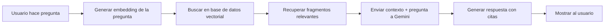

# 🚀 Implementación RAG para OACI.ai

## 📖 Índice
1. [Visión General](#visión-general)
2. [Arquitectura del Sistema](#arquitectura-del-sistema)
3. [Requisitos Previos](#requisitos-previos)
4. [Fase 1: Preparación de Documentos](#fase-1-preparación-de-documentos)
5. [Fase 2: Procesamiento y Embeddings](#fase-2-procesamiento-y-embeddings)
6. [Fase 3: Base de Datos Vectorial](#fase-3-base-de-datos-vectorial)
7. [Fase 4: Integración con el Chat](#fase-4-integración-con-el-chat)
8. [Fase 5: Testing y Optimización](#fase-5-testing-y-optimización)
9. [Costos Estimados](#costos-estimados)

---

## Visión General

El sistema RAG (Retrieval-Augmented Generation) permitirá que OACI.ai responda preguntas basándose en documentos oficiales de la OACI en lugar de solo el conocimiento general del modelo.

### ¿Cómo funciona?



---

## Arquitectura del Sistema

### Componentes Principales

1. **Document Processor**: Extrae y procesa PDFs de la OACI
2. **Embedding Generator**: Convierte texto en vectores usando Gemini Embedding API
3. **Vector Database**: Almacena y busca documentos (usaremos Pinecone o alternativa local)
4. **RAG Orchestrator**: Coordina búsqueda y generación
5. **Chat API**: Integra todo con el frontend existente

### Stack Tecnológico

```
Frontend (Existente)
    ↓
Next.js API Routes
    ↓
RAG Pipeline:
├── PDF Processing: pdf-parse / pdf.js
├── Text Chunking: langchain / custom
├── Embeddings: @google/generative-ai (text-embedding-004)
├── Vector DB: Pinecone (cloud) o ChromaDB (local)
└── LLM: Gemini 2.5 Pro
```

---

## Requisitos Previos

### Documentos Necesarios

> [!IMPORTANT]
> Antes de comenzar, necesitas obtener los documentos oficiales de la OACI en formato PDF.

**Prioridad Alta** (para MVP):
- [ ] Anexo 6 - Operación de Aeronaves
- [ ] Anexo 1 - Licencias al Personal
- [ ] Doc 4444 - PANS-ATM

**Prioridad Media** (para versión completa):
- [ ] Anexo 2 - Reglamento del Aire
- [ ] Anexo 8 - Aeronavegabilidad
- [ ] Anexo 14 - Aeródromos
- [ ] Otros anexos según necesidad

### Dependencias de Software

```bash
npm install --save \
  pdf-parse \
  @pinecone-database/pinecone \
  langchain \
  @langchain/google-genai \
  dotenv
```

### APIs y Servicios

1. **Google AI API Key** (ya tienes) ✅
2. **Pinecone Account** (gratis hasta 1M vectores)
   - Registrarse en: https://www.pinecone.io/
   - Crear índice con dimensión 768 (para text-embedding-004)

---

## Fase 1: Preparación de Documentos

### 1.1 Organizar Documentos

Crear estructura de carpetas:

```
pocket-oaci/
├── data/
│   ├── raw/              # PDFs e Imágenes originales (.pdf, .png, .jpg)
│   ├── processed/        # JSONs extraídos (Texto y Datos Estructurados)
│   ├── chunks/           # Fragmentos semánticos
│   └── embeddings/       # Vectores híbridos (Dense + Sparse)
├── scripts/
│   ├── 1-extract-images.ts       # Extracción visual con Gemini Vision
│   ├── 1-extract-pdf-enhanced.ts # Extracción de texto PDF
│   ├── 2-enrich-data.ts          # Normalización de datos
│   ├── 3-chunk-text.ts           # Chunking semántico
│   ├── 4-generate-embeddings.ts  # Generación híbrida
│   └── 5-upload-to-pinecone.ts   # Indexación
└── lib/
    └── rag/
        ├── rag-service.ts
        └── ...
```

### 1.2 Script de Extracción de PDFs

**Archivo**: `scripts/1-extract-pdf.ts`

```typescript
import fs from 'fs';
import path from 'path';
import pdf from 'pdf-parse';

interface DocumentMetadata {
  filename: string;
  title: string;
  type: 'annex' | 'doc' | 'manual';
  number: string;
  extractedAt: string;
}

async function extractPDF(pdfPath: string): Promise<{text: string, metadata: DocumentMetadata}> {
  const dataBuffer = fs.readFileSync(pdfPath);
  const data = await pdf(dataBuffer);
  
  // Extraer metadata del nombre del archivo
  const filename = path.basename(pdfPath);
  const metadata: DocumentMetadata = {
    filename,
    title: data.info?.Title || filename,
    type: filename.toLowerCase().includes('anexo') ? 'annex' : 'doc',
    number: extractDocNumber(filename),
    extractedAt: new Date().toISOString()
  };
  
  return {
    text: data.text,
    metadata
  };
}

function extractDocNumber(filename: string): string {
  const match = filename.match(/(\d+)/);
  return match ? match[1] : 'unknown';
}

async function processAllPDFs() {
  const rawDir = path.join(process.cwd(), 'data', 'raw');
  const processedDir = path.join(process.cwd(), 'data', 'processed');
  
  // Crear directorio si no existe
  if (!fs.existsSync(processedDir)) {
    fs.mkdirSync(processedDir, { recursive: true });
  }
  
  const files = fs.readdirSync(rawDir).filter(f => f.endsWith('.pdf'));
  
  console.log(`📄 Encontrados ${files.length} PDFs para procesar...`);
  
  for (const file of files) {
    console.log(`\n🔄 Procesando: ${file}`);
    const pdfPath = path.join(rawDir, file);
    
    try {
      const { text, metadata } = await extractPDF(pdfPath);
      
      // Guardar texto extraído
      const outputPath = path.join(processedDir, `${path.parse(file).name}.json`);
      fs.writeFileSync(outputPath, JSON.stringify({
        metadata,
        text,
        pageCount: text.split('\n\n').length
      }, null, 2));
      
      console.log(`✅ Extraído: ${text.length} caracteres`);
    } catch (error) {
      console.error(`❌ Error procesando ${file}:`, error);
    }
  }
  
  console.log('\n✨ Extracción completada!');
}

// Ejecutar
processAllPDFs().catch(console.error);
```

**Uso**:
```bash
# 1. Para Imágenes (Cartas):
npx ts-node scripts/1-extract-images.ts

# 2. Para PDFs (Regulaciones):
npx ts-node scripts/1-extract-pdf-enhanced.ts
```

---

## Fase 2: Procesamiento y Embeddings

### 2.1 Chunking Strategy

Los documentos OACI tienen estructura jerárquica (Anexo → Capítulo → Sección). Usaremos chunking semántico:

**Archivo**: `scripts/2-chunk-text.ts`

```typescript
import fs from 'fs';
import path from 'path';

interface Chunk {
  id: string;
  text: string;
  metadata: {
    source: string;
    docType: string;
    docNumber: string;
    chapter?: string;
    section?: string;
    pageRange?: string;
  };
}

function chunkDocument(text: string, metadata: any): Chunk[] {
  const chunks: Chunk[] = [];
  
  // Estrategia 1: Dividir por secciones (identificadas por patrones)
  const sections = text.split(/(?=\n\s*\d+\.\d+\s+[A-Z])/); // Ej: "4.2.3 TÍTULO"
  
  sections.forEach((section, index) => {
    // Dividir secciones largas en sub-chunks de ~500 palabras
    const words = section.split(/\s+/);
    const chunkSize = 500;
    const overlap = 50; // Palabras de solapamiento
    
    for (let i = 0; i < words.length; i += chunkSize - overlap) {
      const chunkWords = words.slice(i, i + chunkSize);
      const chunkText = chunkWords.join(' ').trim();
      
      if (chunkText.length < 100) continue; // Ignorar chunks muy pequeños
      
      // Extraer número de sección si existe
      const sectionMatch = chunkText.match(/^(\d+\.\d+(?:\.\d+)?)\s+([A-Z][^\n]+)/);
      
      chunks.push({
        id: `${metadata.filename}-${index}-${i}`,
        text: chunkText,
        metadata: {
          source: metadata.filename,
          docType: metadata.type,
          docNumber: metadata.number,
          section: sectionMatch ? sectionMatch[1] : undefined,
          chapter: sectionMatch ? sectionMatch[1].split('.')[0] : undefined,
        }
      });
    }
  });
  
  return chunks;
}

async function processAllDocuments() {
  const processedDir = path.join(process.cwd(), 'data', 'processed');
  const chunksDir = path.join(process.cwd(), 'data', 'chunks');
  
  if (!fs.existsSync(chunksDir)) {
    fs.mkdirSync(chunksDir, { recursive: true });
  }
  
  const files = fs.readdirSync(processedDir).filter(f => f.endsWith('.json'));
  
  console.log(`📝 Procesando ${files.length} documentos...`);
  
  let totalChunks = 0;
  
  for (const file of files) {
    const filePath = path.join(processedDir, file);
    const doc = JSON.parse(fs.readFileSync(filePath, 'utf-8'));
    
    console.log(`\n🔄 Chunking: ${doc.metadata.filename}`);
    const chunks = chunkDocument(doc.text, doc.metadata);
    
    // Guardar chunks
    const outputPath = path.join(chunksDir, file);
    fs.writeFileSync(outputPath, JSON.stringify(chunks, null, 2));
    
    console.log(`✅ Generados ${chunks.length} chunks`);
    totalChunks += chunks.length;
  }
  
  console.log(`\n✨ Total: ${totalChunks} chunks generados!`);
}

processAllDocuments().catch(console.error);
```

### 2.2 Generar Embeddings

**Archivo**: `scripts/3-generate-embeddings.ts`

```typescript
import { GoogleGenerativeAI } from '@google/generative-ai';
import fs from 'fs';
import path from 'path';
import dotenv from 'dotenv';

dotenv.config({ path: '.env.local' });

const genAI = new GoogleGenerativeAI(process.env.GOOGLE_API_KEY!);

interface ChunkWithEmbedding {
  id: string;
  text: string;
  embedding: number[];
  metadata: any;
}

async function generateEmbedding(text: string): Promise<number[]> {
  const model = genAI.getGenerativeModel({ model: 'text-embedding-004' });
  const result = await model.embedContent(text);
  return result.embedding.values;
}

async function processChunksWithEmbeddings() {
  const chunksDir = path.join(process.cwd(), 'data', 'chunks');
  const embeddingsDir = path.join(process.cwd(), 'data', 'embeddings');
  
  if (!fs.existsSync(embeddingsDir)) {
    fs.mkdirSync(embeddingsDir, { recursive: true });
  }
  
  const files = fs.readdirSync(chunksDir).filter(f => f.endsWith('.json'));
  
  console.log(`🧮 Generando embeddings para ${files.length} archivos...`);
  
  for (const file of files) {
    const filePath = path.join(chunksDir, file);
    const chunks = JSON.parse(fs.readFileSync(filePath, 'utf-8'));
    
    console.log(`\n🔄 Procesando: ${file} (${chunks.length} chunks)`);
    
    const chunksWithEmbeddings: ChunkWithEmbedding[] = [];
    
    for (let i = 0; i < chunks.length; i++) {
      const chunk = chunks[i];
      
      try {
        console.log(`  ${i + 1}/${chunks.length} - Generando embedding...`);
        const embedding = await generateEmbedding(chunk.text);
        
        chunksWithEmbeddings.push({
          ...chunk,
          embedding
        });
        
        // Rate limiting: esperar 1 segundo entre requests
        await new Promise(resolve => setTimeout(resolve, 1000));
        
      } catch (error) {
        console.error(`❌ Error en chunk ${chunk.id}:`, error);
      }
    }
    
    // Guardar
    const outputPath = path.join(embeddingsDir, file);
    fs.writeFileSync(outputPath, JSON.stringify(chunksWithEmbeddings, null, 2));
    
    console.log(`✅ Guardados ${chunksWithEmbeddings.length} embeddings`);
  }
  
  console.log('\n✨ Embeddings generados!');
}

processChunksWithEmbeddings().catch(console.error);
```

---

## Fase 3: Base de Datos Vectorial

### Opción A: Pinecone (Cloud - Recomendado para producción)

**Archivo**: `scripts/4-upload-to-pinecone.ts`

```typescript
import { Pinecone } from '@pinecone-database/pinecone';
import fs from 'fs';
import path from 'path';
import dotenv from 'dotenv';

dotenv.config({ path: '.env.local' });

const pinecone = new Pinecone({
  apiKey: process.env.PINECONE_API_KEY!,
});

async function uploadToPinecone() {
  const indexName = 'oaci-docs';
  
  // Crear índice si no existe
  const existingIndexes = await pinecone.listIndexes();
  
  if (!existingIndexes.indexes?.some(idx => idx.name === indexName)) {
    console.log('📦 Creando índice en Pinecone...');
    await pinecone.createIndex({
      name: indexName,
      dimension: 768, // text-embedding-004 dimension
      metric: 'cosine',
      spec: {
        serverless: {
          cloud: 'aws',
          region: 'us-east-1'
        }
      }
    });
    
    // Esperar a que el índice esté listo
    await new Promise(resolve => setTimeout(resolve, 10000));
  }
  
  const index = pinecone.index(indexName);
  
  // Cargar embeddings
  const embeddingsDir = path.join(process.cwd(), 'data', 'embeddings');
  const files = fs.readdirSync(embeddingsDir).filter(f => f.endsWith('.json'));
  
  console.log(`📤 Subiendo ${files.length} archivos a Pinecone...`);
  
  for (const file of files) {
    const filePath = path.join(embeddingsDir, file);
    const chunks = JSON.parse(fs.readFileSync(filePath, 'utf-8'));
    
    console.log(`\n🔄 Subiendo: ${file} (${chunks.length} vectores)`);
    
    // Pinecone acepta hasta 100 vectores por batch
    const batchSize = 100;
    
    for (let i = 0; i < chunks.length; i += batchSize) {
      const batch = chunks.slice(i, i + batchSize);
      
      const vectors = batch.map((chunk: any) => ({
        id: chunk.id,
        values: chunk.embedding,
        metadata: {
          text: chunk.text,
          ...chunk.metadata
        }
      }));
      
      await index.upsert(vectors);
      console.log(`  ✅ Subidos ${i + batch.length}/${chunks.length}`);
    }
  }
  
  console.log('\n✨ Todos los vectores subidos a Pinecone!');
  
  // Verificar
  const stats = await index.describeIndexStats();
  console.log(`\n📊 Estadísticas del índice:`, stats);
}

uploadToPinecone().catch(console.error);
```

### Opción B: ChromaDB (Local - Para desarrollo)

```typescript
// Alternativa local sin costos
// npm install chromadb
import { ChromaClient } from 'chromadb';

const client = new ChromaClient();
const collection = await client.createCollection({ name: 'oaci-docs' });

// Similar al código de Pinecone pero usando ChromaDB API
```

---

## Fase 4: Integración con el Chat

### 4.1 Servicio RAG

**Archivo**: `lib/rag/rag-service.ts`

```typescript
import { GoogleGenerativeAI } from '@google/generative-ai';
import { Pinecone } from '@pinecone-database/pinecone';

const genAI = new GoogleGenerativeAI(process.env.GOOGLE_API_KEY!);
const pinecone = new Pinecone({ apiKey: process.env.PINECONE_API_KEY! });

export interface RAGResult {
  answer: string;
  sources: Array<{
    text: string;
    source: string;
    section?: string;
  }>;
}

export async function queryRAG(question: string, locale: string = 'es'): Promise<RAGResult> {
  // 1. Generar embedding de la pregunta
  const embeddingModel = genAI.getGenerativeModel({ model: 'text-embedding-004' });
  const questionEmbedding = await embeddingModel.embedContent(question);
  
  // 2. Buscar en Pinecone
  const index = pinecone.index('oaci-docs');
  const searchResults = await index.query({
    vector: questionEmbedding.embedding.values,
    topK: 5, // Top 5 resultados más relevantes
    includeMetadata: true
  });
  
  // 3. Extraer contexto relevante
  const context = searchResults.matches
    .map(match => match.metadata?.text)
    .filter(Boolean)
    .join('\n\n---\n\n');
  
  // 4. Generar respuesta con contexto
  const systemPrompt = locale === 'es'
    ? `Eres OACI.ai, un asistente experto en regulaciones de aviación civil internacional.
    
    CONTEXTO DE DOCUMENTOS OFICIALES:
    ${context}
    
    INSTRUCCIONES:
    1. Responde SOLO basándote en el contexto proporcionado.
    2. Si la información no está en el contexto, di "No encuentro esta información en los documentos disponibles".
    3. SIEMPRE cita la fuente exacta (Anexo, Capítulo, Sección).
    4. Sé claro, directo y profesional.
    5. Responde en ESPAÑOL.`
    : `You are OACI.ai, an expert in international civil aviation regulations.
    
    OFFICIAL DOCUMENTS CONTEXT:
    ${context}
    
    INSTRUCTIONS:
    1. Answer ONLY based on the provided context.
    2. If information is not in context, say "I cannot find this information in available documents".
    3. ALWAYS cite exact source (Annex, Chapter, Section).
    4. Be clear, direct, and professional.
    5. Answer in ENGLISH.`;
  
  const model = genAI.getGenerativeModel({ model: 'gemini-2.5-pro-preview-03-25' });
  const chat = model.startChat({
    history: [
      { role: 'user', parts: [{ text: systemPrompt }] },
      { role: 'model', parts: [{ text: locale === 'es' ? 'Entendido.' : 'Understood.' }] }
    ]
  });
  
  const result = await chat.sendMessage(question);
  
  // 5. Retornar respuesta con fuentes
  return {
    answer: result.response.text(),
    sources: searchResults.matches.map(match => ({
      text: match.metadata?.text as string || '',
      source: match.metadata?.source as string || '',
      section: match.metadata?.section as string
    }))
  };
}
```

### 4.2 Actualizar API Route

**Archivo**: `app/api/chat/route.ts` (modificar)

```typescript
import { queryRAG } from '@/lib/rag/rag-service';
import { NextResponse } from 'next/server';

export async function POST(req: Request) {
  try {
    const { message, locale } = await req.json();
    
    // Usar RAG en lugar de solo el modelo
    const result = await queryRAG(message, locale);
    
    return NextResponse.json({
      text: result.answer,
      sources: result.sources,
      source: 'RAG - Official ICAO Documents'
    });
    
  } catch (error: any) {
    console.error('RAG Error:', error);
    return NextResponse.json(
      { error: `Error: ${error.message}` },
      { status: 500 }
    );
  }
}
```

---

## Fase 5: Testing y Optimización

### 5.1 Test Cases

Crear archivo `tests/rag-test-cases.json`:

```json
[
  {
    "question": "¿Cuál es la edad mínima para obtener una licencia de piloto comercial?",
    "expectedSource": "Anexo 1",
    "expectedSection": "2.1"
  },
  {
    "question": "¿Qué requisitos de combustible mínimo se requieren para vuelos IFR?",
    "expectedSource": "Anexo 6",
    "expectedSection": "4.3.6"
  }
]
```

### 5.2 Script de Testing

```typescript
// scripts/test-rag.ts
import { queryRAG } from '../lib/rag/rag-service';
import testCases from '../tests/rag-test-cases.json';

async function testRAG() {
  console.log('🧪 Iniciando tests del RAG...\n');
  
  for (const testCase of testCases) {
    console.log(`❓ Pregunta: ${testCase.question}`);
    
    const result = await queryRAG(testCase.question, 'es');
    
    console.log(`✅ Respuesta: ${result.answer.substring(0, 200)}...`);
    console.log(`📚 Fuentes: ${result.sources.map(s => s.source).join(', ')}`);
    console.log('---\n');
  }
}

testRAG();
```

---

## Costos Estimados

### Google AI (Gemini)

| Servicio | Costo | Estimación |
|----------|-------|------------|
| text-embedding-004 | Gratis hasta 1500 req/día | Suficiente para desarrollo |
| gemini-2.5-pro | $0.00125 / 1K chars input | ~$5-10/mes uso moderado |

### Pinecone

| Plan | Vectores | Costo |
|------|----------|-------|
| Free Tier | 1M vectores | $0/mes |
| Standard | 10M vectores | $70/mes |

**Estimación para MVP**: 
- 3 documentos × ~500 chunks = 1,500 vectores
- **Costo total: $0/mes** (dentro de free tiers)

---

## 🎯 Plan de Acción Inmediato

### Mientras consigues los documentos:

1. **Ahora** - Configurar estructura de carpetas:
   ```bash
   mkdir -p data/{raw,processed,chunks,embeddings}
   mkdir -p scripts lib/rag tests
   ```

2. **Ahora** - Instalar dependencias:
   ```bash
   npm install pdf-parse @pinecone-database/pinecone langchain dotenv tsx
   ```

3. **Ahora** - Crear cuenta en Pinecone:
   - Ir a https://www.pinecone.io/
   - Registrarse (gratis)
   - Obtener API key
   - Añadir a `.env.local`: `PINECONE_API_KEY=tu_key`

4. **Cuando tengas PDFs** - Ejecutar pipeline:
   ```bash
   # Paso 1: Extraer texto
   npx tsx scripts/1-extract-pdf.ts
   
   # Paso 2: Generar chunks
   npx tsx scripts/2-chunk-text.ts
   
   # Paso 3: Crear embeddings
   npx tsx scripts/3-generate-embeddings.ts
   
   # Paso 4: Subir a Pinecone
   npx tsx scripts/4-upload-to-pinecone.ts
   ```

---

## 📞 Próximos Pasos

Una vez tengas este README:

1. ✅ Revisa la arquitectura propuesta
2. ✅ Configura Pinecone
3. ✅ Consigue al menos 1 PDF de prueba (Anexo 6 recomendado)
4. ✅ Ejecutamos el pipeline juntos paso a paso

¿Alguna pregunta sobre la implementación? ¿Quieres que empiece a crear los scripts mientras consigues los documentos?
